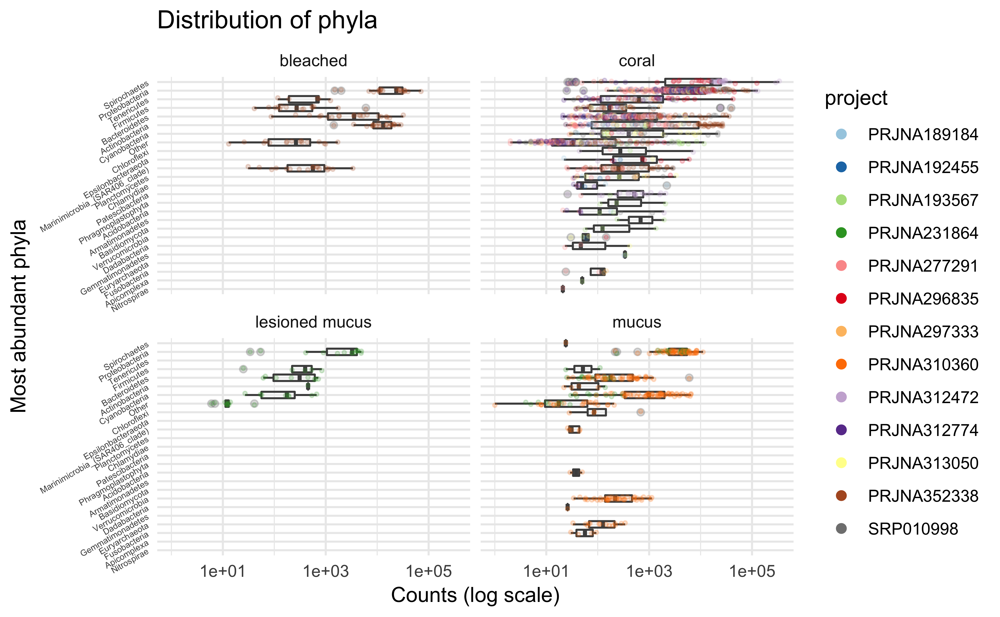
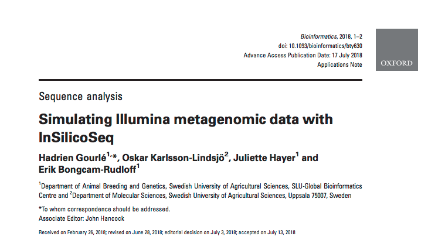

 
# {#intro-slide data-background="assets/img/background.jpg"}

## {#intro-slide data-background="assets/img/background.jpg"}

Coral reefs are one of the most diverse ecosystem on the planet.
 

They face great challenges and their population is rapidely declining.
 

Can research help?

## Where? {#map data-background="assets/img/map_cropped.png"}

  

## What?

- Monitor the health of coral reefs using bacterial communities
- Characterize the relationship between corals and their microbial environment

# Survey of the field

## Literature review

## 13 metabarcoding studies

## 13 metabarcoding studies

## But...

<h3>what do they do?</h3>

# Whole metagenome Sequencing

- Give insight into function and metabolism

## {data-background="assets/img/wordcloud.svg"}

## Which one works best?

No **independant**, **comprehensive** and **extensible** benchmarks of taxonomic classifiers exists yet

## Which one works best?

doi: 10.1093/bioinformatics/bty390

## {data-background="assets/img/wordcloud.svg"}

# Applying WMS to coral reef communities

## Surrounding the reef

Ultra-deep sequencing of sediment and water samples in close proximity of coral reefs

## {data-background="assets/img/dive.svg"}

## A dive in the coral reef microbiome

*TODO*
