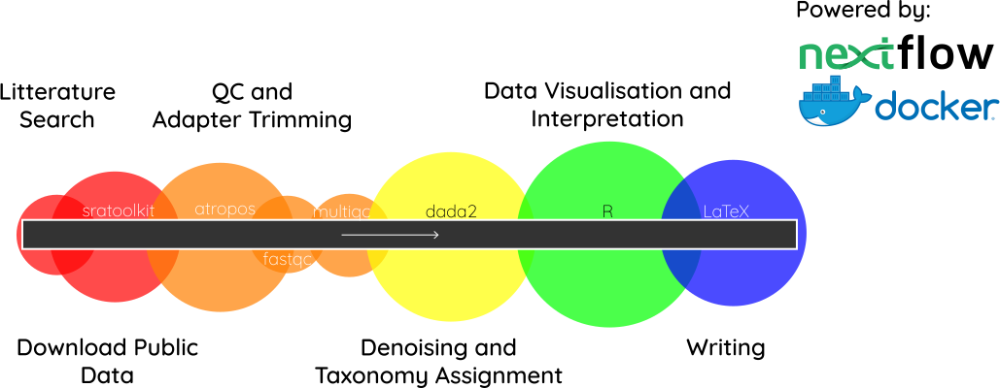
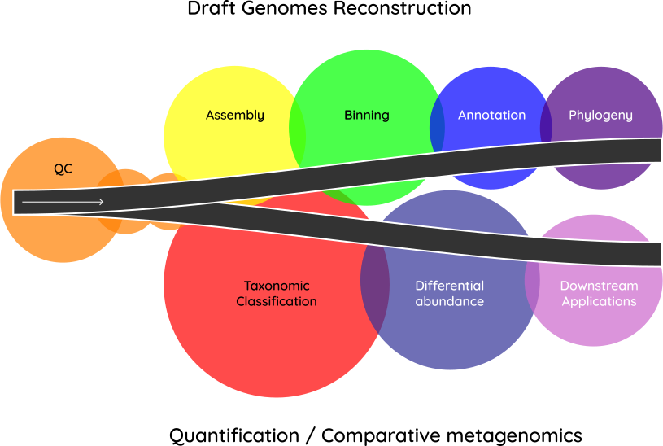
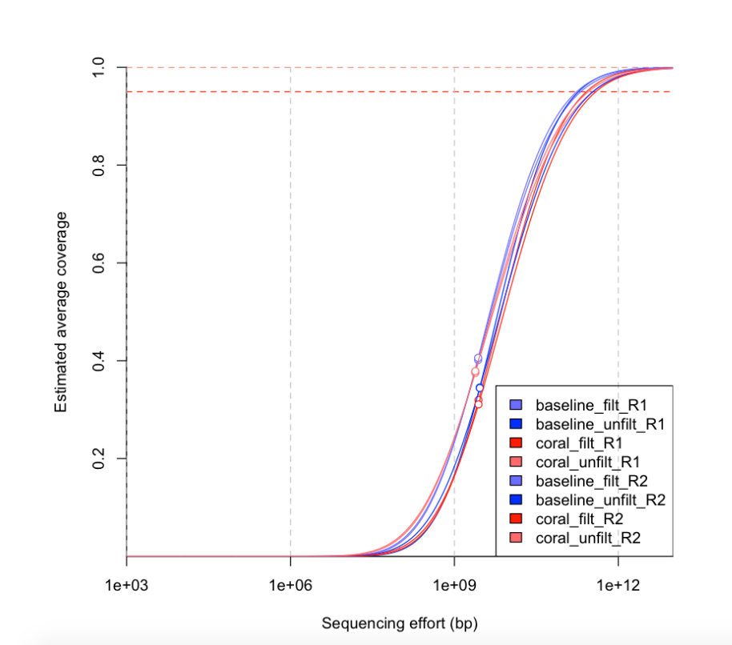

 
# {#intro-slide data-background="assets/img/background.jpg"}

## {#intro-slide data-background="assets/img/background.jpg"}

Coral reefs are one of the most diverse ecosystem on the planet.
 

They face great challenges and their population is rapidely declining.
 

Can research help?

## Where? {#map data-background="assets/img/map_cropped.png"}

  
## What?

- Monitor the health of coral reefs using bacterial communities
- Characterize the relationship between corals and their microbial environment

## Why?

- Bacterial communities relatively understudied
- We do not know what are their role in the ecosystem
- Beneficial Microorganisms for corals (BMCs)

# Litterature Review

## The 16S rRNA {#sixteen}

## The workflow {#workflow-slide}

## 13 metabarcoding studies

## 13 metabarcoding studies

## But...

<h3>what do they do?</h3>

# Whole metagenome Sequencing

- Give insight into function and metabolism

## WMS - The workflow {#workflow-wms}

## {data-background="assets/img/wordcloud.svg"}

## Which one works best?

No **independant**, **comprehensive** and **extensible** benchmarks of taxonomic classifiers exists yet

## Which one works best?

doi: 10.1093/bioinformatics/bty390

## {data-background="assets/img/wordcloud.svg"}

# Applying WMS to coral reef communities

## Surrounding the reef

Ultra-deep sequencing of sediment and water samples in close proximity of coral reefs

## {data-background="assets/img/dive.svg"}

## Surrounding the reef

- 6 sampling sites
- water and sediment samples
- NovaSeq sequencing (~ 300G / sample)

## 300G? {#nonpareil}

## A dive in the coral reef microbiome

## {data-background="assets/img/bmc_big.jpg"}

## A dive in the coral reef microbiome

- 10 sampling sites
- mucus samples
- DNA and RNA sequencing

# Thank you!

## Thank you! {#thanks}

## Image rights and attributions

- "16s RNA": Public domain
- "Possible roles between corals and symbionts": CC BY. *Copyright 2017 Peixoto, Rosado, Leite, Rosado and Bourne (doi: 10.3389/fmicb.2017.00341)*
- All other images: CC BY. *Copyright 2018 Hadrien Gourlé*
